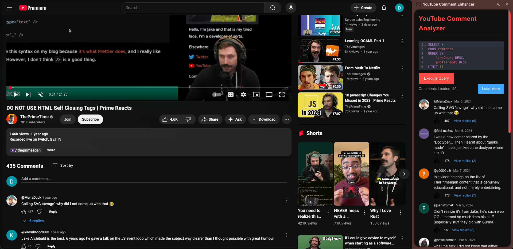

# YouTube Comment Analyzer - Chrome Extension

A Chrome browser extension that fetches comments from YouTube videos using the YouTube Data API and provides a SQL editor to analyze them.

---

---

## Installation

### Prerequisites

- [A Google Cloud Platform (GCP) project with the **YouTube Data API v3** enabled](https://developers.google.com/youtube/v3/getting-started#before-you-start).

### Steps

1. Clone this repository: `git clone https://github.com/your-username/youtube-comment-analyzer.git`

2. `npm install`

3. `npm run build`

4. [Load the unpacked extension to your Chrome browser.](https://developer.chrome.com/docs/extensions/get-started/tutorial/hello-world#load-unpacked)
